# Digital Factory — Business Requirements Specification

**XRF Handheld Device Production**

| | |
|---|---|
| Prepared by | Manufacturing / Factory Management |
| For | Software Engineering Team |
| Version | 1.0 — Draft for Specification |
| Date | June 16, 2026 |

---

## 1. Purpose and Scope

### 1.1 Purpose of this document

This document states the business requirements for a Digital Factory system that manages the production of XRF handheld devices. It is written from the perspective of factory and manufacturing management and describes what the system must do, must prevent, and must record on the production floor.

It is intentionally written in operational language rather than technical language. The software engineering team is expected to convert these requirements into technical specifications, system design, and implementation. Where this document expresses a preference about how something should behave, that preference is a business rule, not a design instruction.

### 1.2 What the system is

The Digital Factory is, at its core, a Manufacturing Execution System (MES) with full per-unit traceability built in from the start. It is the system of record for what was built, how it was built, who built it, and whether it is fit to ship. For a regulated measuring instrument such as an XRF analyzer, per-unit traceability and a defensible calibration record are part of the product's credibility, not an optional add-on.

**Note on a digital twin / line simulation:** Throughput modeling and line-layout simulation are explicitly out of scope for this first version. They may be considered later, once real production data is flowing through the system. The priority is to capture reality accurately first.

### 1.3 Scope boundary

The Digital Factory owns the production flow from the moment an approved order is received through to the device being shipped. The following sit outside this system and are integrated with as external systems:

- The eStore and sales approval workflow (upstream) — these hand the factory an approved order.
- The Cloud platform — the factory talks to it for software/firmware currency, device provisioning, and record backup.
- The Inventory Management module — owns parts, serial numbers, and lots; the factory consumes and updates allocation/serial data across an interface. This module is to be designed separately.

Packaging and shipping (the final two stages) are owned for now but must be kept architecturally separable, so they can be moved into a dedicated fulfillment system in the future without disrupting the production core.

---

## 2. The Production Flow (Spine)

Every device moves through the following stages in order. Stages 1–2 are upstream (external). The factory system owns stages 3–14; stages 13–14 are owned but separable.

| Stage | Name | Ownership |
|---|---|---|
| 1 | Order created (customer customizes & orders on eStore) | External (upstream) |
| 2 | Order approved (sales manager) | External (upstream) |
| 3 | Order received by factory | Factory — core |
| 4 | Parts allocated to the order (serial level) | Factory — core |
| 5 | Assembly (scan & verify each part at assembly) | Factory — core |
| 6 | Software & firmware installed (validated baseline) | Factory — core |
| 7 | Software & firmware updated from cloud | Factory — core |
| 8 | Device provisioned with cloud (identity issued) | Factory — core |
| 9 | Hardware checks / setup | Factory — core (gate) |
| 10 | Calibration | Factory — core (gate) |
| 11 | Quality Control (QC) | Factory — core (gate) |
| 12 | Backup of factory data to cloud | Factory — core |
| 13 | Package | Factory — separable |
| 14 | Ship | Factory — separable |

**Gate** = a stage that can pass or fail a unit and route it to rework. The three gates (9, 10, 11) are independent: a unit must clear each to reach the next, and a failure at any gate routes to a disposition path specific to that stage.

---

## 3. System-Wide Principles

These principles apply across all stages and underpin the detailed requirements that follow.

**GP-1** — The order is the authoritative definition of what a unit should be. Allocation, assembly verification, and the hardware/calibration/QC gates all validate the built unit against its order.
*Rationale: A single source of truth for "what this unit is supposed to be" prevents the gates from disagreeing with each other.*

**GP-2** — Strict by default, controlled override at the right authority level, always logged. Where the floor must be able to deviate, deviation is permitted only to an authorized role and is always recorded with who, when, why.

**GP-3** — Hard-stops cannot be clicked past by operators. A blocked step shows a clear on-screen reason and cannot proceed at the bench.

**GP-4** — Every override, authorization, waiver, re-allocation, and gate result carries the identity of the role-holder who performed it, and is retained in the unit's permanent record.
*Rationale: This is what makes the role tiers meaningful and the record defensible to an auditor.*

**GP-5** — The system must be extensible without re-engineering for: new serial-worthy sub-assembly types, and new device model recipes. Adding either should be a configuration/data action, not a code change.

**GP-6** — The unit's permanent record (genealogy, calibration certificate, gate results, full history) is the irreplaceable artifact of a regulated instrument and must be protected accordingly.

---

## 4. Detailed Requirements by Stage

### 4.0 The tracked unit

**UNIT-1** — The system tracks an individual device and its serial-worthy sub-assemblies, married together into a single final device serial (the "genealogy serial").

**UNIT-2** — The following sub-assemblies are serial-worthy and are married into the device genealogy: X-ray tube, Detector, DPP (digital pulse processor), SOM (system-on-module), MCB (carrier board), Battery pack, BMS board, Chassis. This list must be extensible (see GP-5).

**UNIT-3** — Serial numbers and lot information are owned by the Inventory Management module. The factory system consumes (and binds) serial/lot data from that module across an interface; it does not own the inventory record.
*Rationale: Keeps the inventory module independently designable.*

### 4.1 Stage 3 — Order received

An approved order is handed to the factory across the boundary from the eStore / sales-approval side. The factory validates it before admitting it to the floor.

**ORD-1** — An approved order must contain, at minimum: order identifier; model/variant; chosen options/flags within that model; quantity; and an approval marker (who approved, and when).

**ORD-2** — The system must validate an incoming order at the boundary and reject any order that is missing a required field or names an unknown model. The rejection reason must be reported back to the upstream system.
*Rationale: Don't let a malformed or un-buildable order onto the floor — same philosophy as the assembly hard-stops.*

**ORD-3** — An order for a model that has no known recipe in the system must be rejected. A model recipe must exist before an order for that model can be admitted (see model recipes, MDL-1).

**ORD-4** — Logistics information (destination, carrier, billing, tracking) is explicitly NOT required on the order and is out of scope for the factory system (reserved for fulfillment).

### 4.2 Stage 4 — Parts allocated (serial level)

**ALLOC-1** — Allocation reserves specific serial numbers for the order. The inventory operator delivers those exact units to the bench.
*Rationale: Parts are QC'ed at incoming before entering inventory, so every serial in stock is already known-good; this makes strict serial-level allocation workable and gives the strongest traceability.*

**ALLOC-2** — When an allocated serial cannot be used (damaged, lost, failed at the bench, or reprioritized), a supervisor may re-allocate a replacement serial of the same type. The swap must be logged: who, when, why, old serial, new serial.

**ALLOC-3** — Both the original (released) serial and its replacement must remain in the unit's genealogy / history. Re-allocation does not erase the original.

**ALLOC-4** — Re-allocation is not automatic and does not halt the order. It requires supervisor authorization (see roles, Section 5).
*Rationale: Silent auto-swaps would lose the "why did this unit get a different part than planned" trail; halting entirely is too brittle at 10+/day.*

**ALLOC-5** — When a serial is released, the system reports the release reason code (e.g. damaged / lost / failed-at-bench / reprioritized) to the Inventory Management module and lets that module decide the part's fate. The factory system must NOT return a part to available stock on its own authority.
*Rationale: The factory knows why the swap happened, but judging the part is inventory's job.*

### 4.3 Stage 5 — Assembly

The assembler scans each serialized part at the moment of assembly and builds the device. The scan is a verification gate that confirms the right allocated part is being fitted — not a part-selection step (delivering the correct parts to the bench is the inventory operator's responsibility, ALLOC-1).

**ASM-1** — At each assembly scan, the system must HARD-STOP (block the step, show a clear reason, no operator override at the bench) in all of the following cases:

- Wrong part type for the step being performed.
- Wrong / unallocated serial — a part that is not the specific serial reserved for this order.
- Already-used serial — that exact part is already married into another device.
- Out-of-sequence — a part scanned for a step that should not happen yet.
- Unknown serial — the scan matches nothing the inventory module knows.

**ASM-2** — There is no override of an assembly hard-stop at the bench. Correctness of delivered parts is enforced upstream by the inventory operator; the bench scan is the verification that catches anything wrong that reached the station anyway.

**ASM-3** — A successful assembly scan binds (marries) that specific serial to the device's genealogy.

### 4.4 Stages 6–8 — Software, firmware and cloud provisioning

#### Stage 6 — Software & firmware install

**SW-1** — Every device receives the same pinned, validated factory software/firmware baseline at install. The device reaches a known, identical software state before it touches the network.
*Rationale: If calibration or test later fails, a known baseline lets you rule out "mystery software"; it also gives a clean audit answer to "what was originally installed."*

**SW-2** — At install, the device does not yet have a unique cloud identity; it carries only the generic validated baseline.

#### Stage 7 — Software & firmware update from cloud

**SW-3** — A unit cannot pass stage 7 until it has confirmed it holds the latest production software/firmware from the cloud.

**SW-4** — If the cloud is unreachable at stage 7, affected units are HARD-BLOCKED and wait until the cloud returns. There is no override path.

> **⚠️ Documented management decision:** By explicit decision of factory management, production throughput is intentionally coupled to cloud availability at stage 7. A cloud or connectivity outage will halt progression of all affected units with no override path. This is an accepted operational tradeoff in exchange for guaranteeing that every shipped unit carries the latest production software/firmware. This choice was made deliberately, not by oversight.

**SW-5** — Because stage 7 couples the line to cloud availability, the system must monitor cloud/connectivity availability and alert the floor immediately when stage 7 is blocked and why, so a stoppage is visible at once rather than discovered as a silent pile-up.
*Rationale: Derived requirement following from SW-4.*

#### Stage 8 — Cloud provisioning (device identity)

**PROV-1** — The device's permanent cloud identity is created at provisioning (stage 8), when the device is enrolled with the cloud and issued its operational credentials.

**PROV-2** — The cloud identity is a separate credential (keys / certificate), distinct from the genealogy serial, but bound one-to-one to it.

**PROV-3** — The cloud credential must be independently rotatable: if it is compromised or expires, the cloud can re-issue a new credential bound to the same unchanging genealogy serial. The genealogy serial (physically printed and baked into the build history) must never change.
*Rationale: Lets a compromised credential be replaced without altering the device's physical identity or build record.*

### 4.5 Stages 9–11 — The gates

**GATE-1** — Stages 9 (hardware checks), 10 (calibration) and 11 (QC) are three independent gates. A unit must pass each gate to reach the next.

**GATE-2** — Each gate has its own pass/fail and its own rework routing. A failure at one gate routes to a disposition path specific to that stage and re-enters the flow at the correct point.
*Rationale: The three gates answer different questions; keeping them independent preserves the "why did it fail" signal needed for yield analysis as volume scales from ~10/day to 100+/day.*

#### Stage 9 — Hardware checks / setup

**HW-1** — The hardware checks performed, and their pass criteria, are determined by the device model the customer ordered (configuration-driven). The system runs the checks appropriate to that model's recipe.

**HW-2** — The system must verify the built unit matches its ordered model recipe, and flag missing expected hardware or unexpected hardware present.

**MDL-1** — The product is offered as a handful of fixed models/variants, each with a known fixed hardware recipe (the customer picks a model, possibly with a few options). The system holds a small set of model recipes; it does not need a combinatorial configuration engine. New models can be added as new recipes (see GP-5).

#### Stage 10 — Calibration

**CAL-1** — On a successful calibration, the system must capture and retain a full, reproducible calibration record, including: the reference standards used (with their certificate IDs and expiry); the raw readings taken against each standard; the resulting coefficients written to the device; the calibration equipment/fixture ID; the operator; the timestamp; environmental conditions; and the firmware/software version on the device at calibration time.

**CAL-2** — Reference standards are tracked entities in the system, each with its certificate ID, expiry, and identifier, so the calibration station can verify validity at the point of use.
*Rationale: Derived from CAL-1 — the system can only enforce standard validity if it tracks the standards.*

**CAL-3** — Calibration must HARD-STOP (cannot begin or complete, no override) if any reference standard in use is expired or lacks a valid certificate.
*Rationale: A calibration against an out-of-cert standard produces a certificate that cannot survive scrutiny; the system already knows the validity (CAL-1), so it must act on it.*

**CAL-4** — A unit may retry calibration up to a maximum of 3 attempts. Every attempt — including failed ones — is retained in the full internal record.

**CAL-5** — On exceeding the retry cap, the unit must escalate to a supervisor disposition, who routes it either back to hardware (stage 9) or to scrap/quarantine. The disposition reason is logged. A unit may not retry indefinitely.

**CAL-6** — The shipped calibration certificate shows only the valid passing calibration run. The full internal record retains all attempts. (Clean certificate, complete history.)

#### Stage 11 — Quality Control (QC)

**QC-1** — QC is the final human sign-off on both the physical unit and its complete record. It covers physical/cosmetic condition, correct labeling and serial, accessories and seals, AND verification that the digital record is complete and consistent (genealogy complete, calibration certificate generated, every prior required gate actually passed, required regulatory documents present).

**QC-2** — QC must verify that the unit actually passed every prior required stage — a last guard against a unit reaching the end with a gap in its record.

**QC-3** — Passing QC is the formal trigger that finalizes the unit's record and authorizes the unit for stage 12 (cloud backup) and shipping. Passing QC flips the unit to "complete, certified, shippable."

### 4.6 Stage 12 — Cloud backup

**BK-1** — After QC, the unit's complete factory record (genealogy, calibration record, certificate, test results) must be backed up to the cloud.

**BK-2** — If the cloud backup cannot complete (cloud or connectivity unavailable), the unit is HARD-BLOCKED and cannot proceed to packaging/shipping until its record is safely backed up. There is no override path. (Consistent with stage 7, SW-4.)

> **⚠️ Documented management decision:** As at stage 7, the line is intentionally coupled to cloud availability here. A device must not leave the floor until its irreplaceable record is preserved off-site. A cloud outage will halt shipping of affected units, with no override. Accepted deliberately.

### 4.7 Stages 13–14 — Package & ship (separable)

**SHIP-1** — The factory system records packaged and shipped status for the unit, with timestamp and operator, and attaches the final shipping documents and the calibration certificate to the unit's record.

**SHIP-2** — Destination, carrier, and tracking are out of scope for the factory system and are reserved for a future fulfillment system.

**SHIP-3** — The packaging/shipping stages must be architecturally separable, so they can be moved into a dedicated fulfillment system later without disrupting the production core. When that happens, fulfillment receives a completed, certified, backed-up unit.

**SHIP-4** — A unit's factory lifecycle is complete at "shipped" — record finalized (at QC), backed up (stage 12), certificate attached, marked shipped. Delivery, field use, and RMA are outside this system's scope (though the record it leaves is what those downstream systems reference).

---

## 5. Roles and Permissions

Authority is tiered. High-cost and accountability actions require higher or distinct authority than routine work and routine overrides.

| Tier | Roles | May do |
|---|---|---|
| Operator | Assembler, Inventory operator | Perform the work of their stage. No override authority — assembly and other hard-stops hold. |
| Supervisor | Line supervisor | Routine overrides: part re-allocation (ALLOC-2); calibration retry authorization; disposition of a failed unit back to hardware (CAL-5). |
| Manager / QC authority | Manager; QC sign-off authority | High-cost / accountability actions: scrap or write-off of a calibrated unit or expensive sub-assembly; final QC sign-off (QC-1, a distinct named authority); separation-of-duty waivers (RBAC-4). |

**RBAC-1** — Scrap / write-off of a calibrated unit or an expensive sub-assembly is a high-cost action requiring the manager tier — not every shift supervisor.
*Rationale: Scrapping a calibrated device or an X-ray tube is a real financial and regulatory event.*

**RBAC-2** — QC sign-off is its own distinct named authority, not merely a permission every supervisor holds. The person who signs "fit to ship" is taking responsibility.

**RBAC-3** — One person may hold multiple roles (necessary at this scale), EXCEPT that the system must enforce separation-of-duty on accountability points: the QC sign-off (and high-cost approvals such as scrap) on a unit cannot be the same person who did the work being signed off on that unit.
*Rationale: If the assembler of a unit can also sign off its QC, the sign-off is meaningless.*

**RBAC-4** — Separation-of-duty is enforced by default but may be WAIVED by the manager tier, for a specific unit, with a recorded justification (who waived, why, which unit). The line never deadlocks on thin staffing; every waiver is a visible, reviewable exception — not routine.
*Rationale: A 10/day shop on a thin shift could otherwise stall finished units; the waiver record also doubles as a staffing signal.*

---

## 6. External Interfaces

The factory system integrates with three external systems. These are stated as business-level interface needs; the engineering team will specify the technical contracts.

### 6.1 eStore / Sales approval (upstream)

**IF-ORD-1** — The factory must receive an approved order containing the fields listed in ORD-1, and must be able to reject an invalid or un-buildable order back to this system with a reason (ORD-2).

### 6.2 Inventory Management module

**IF-INV-1** — The factory must be able to look up and bind serial + lot data for allocated parts (UNIT-3, ASM-3).

**IF-INV-2** — On release of an allocated serial, the factory must report the release reason code to the inventory module and must not change the part's availability itself (ALLOC-5).

### 6.3 Cloud platform

**IF-CLD-1** — The factory must be able to query and obtain the latest production software/firmware from the cloud (stage 7, SW-3).

**IF-CLD-2** — The factory must be able to enroll a device and obtain its cloud identity/credentials at provisioning (stage 8, PROV-1).

**IF-CLD-3** — The factory must be able to back up a unit's complete record to the cloud and receive confirmation of a successful backup (stage 12, BK-1).

**IF-CLD-4** — The factory must detect cloud/connectivity unavailability and surface it to the floor (SW-5), because stages 7 and 12 are hard-blocked on it.

---

## 7. Cross-Cutting Requirements and Items for Engineering

The following are required system-wide qualities or items deferred to the engineering team to specify. They were identified during requirements gathering but do not need further floor-management decisions at this stage, except where noted.

### 7.1 Audit trail and record integrity

**AUD-1** — All records that the requirements call for retaining (overrides, re-allocations, every calibration attempt, gate results, waivers, sign-offs) must be complete and tamper-evident. The unit's record is the legal/traceability backbone of a regulated instrument.

### 7.2 Concurrency and scale

**SCALE-1** — The system must support multiple units, stations, and operators working at once. Target production is approximately 10 devices/day, designed to scale to 100+ devices/day.

> *Open item for management input: whether a single operator may work more than one unit at the same time is a floor-policy question not yet decided.*

### 7.3 Reporting and visibility

**RPT-1** — Management must be able to see, at minimum: where every unit currently is in the flow; which units are blocked and why (especially cloud-blocked units at stages 7 and 12); and yield/failure data per gate to support yield analysis as volume grows.

### 7.4 Items deferred for management decision

The following were flagged during requirements gathering and remain open:

- Single-operator-multiple-units floor policy (see SCALE-1).
- Whether any future software/firmware update should be flaggable as "mandatory before ship" as an exception (the current decision, SW-4, is a uniform hard block with no exception).

---

## 8. Decision Log

Key decisions made during requirements gathering, recorded so they read as deliberate choices rather than oversights.

| # | Decision | Choice made |
|---|---|---|
| 1 | System scope | MES core with full per-unit traceability; digital twin/simulation deferred. |
| 2 | Scope boundary | Factory owns stages 3–14; eStore, cloud, inventory are external; 13–14 separable. |
| 3 | Allocation method | Serial-level (specific serials reserved), supported by incoming QC of parts. |
| 4 | Bad/missing allocated part | Supervisor re-allocation, logged; original + replacement both kept in genealogy. |
| 5 | Released part to inventory | Report reason code; inventory decides fate; factory never frees stock itself. |
| 6 | Assembly mismatch | Hard-stop on all five cases; no bench override. |
| 7 | SW/FW install | Pinned validated baseline first. |
| 8 | SW/FW update on cloud outage | Hard block, no override (documented management tradeoff). |
| 9 | Cloud identity | Created at provisioning; separate credential bound 1:1 to serial; rotatable. |
| 10 | Gates 9/10/11 | Three independent gates, each with own pass/fail and rework. |
| 11 | Hardware checks | Configuration-driven against the ordered model recipe. |
| 12 | Product configurability | A handful of fixed models; unknown-model orders rejected. |
| 13 | Calibration record | Full reproducible record retained. |
| 14 | Expired standard | Hard-stop, no override; standards are tracked entities. |
| 15 | Calibration failure | Retry cap 3 → supervisor disposition; clean certificate, complete history. |
| 16 | QC | Final human sign-off on unit + record; finalizes and authorizes for ship. |
| 17 | Backup on cloud outage | Hard block, no override (documented management tradeoff). |
| 18 | Package/ship | Minimal close-out; logistics out of scope; separable. |
| 19 | Roles | Three tiers; multiple roles per person; separation-of-duty enforced, manager-waivable. |
| 20 | Order contents | Sufficient-for-the-line set required; invalid/unknown-model orders rejected. |

---

## 9. Production Workflow Diagram (All Branches)

The diagram below shows all 14 stages with every branch: hard-stops, rework loops, cloud blocks, retry caps, and disposition paths. It renders as a flowchart in Markdown viewers that support Mermaid (e.g. GitHub, GitLab, Obsidian, VS Code); elsewhere it appears as the code block below.

Reading notes: solid arrows are the normal forward flow; dotted arrows are recovery paths back into the flow. Red nodes are hard-stops (the two cloud blocks at stages 7 and 12 have no override at all — a documented management decision). Purple nodes are the only override points (supervisor re-allocation and disposition; scrap is manager-tier only). A standalone, styled HTML version of this diagram is also provided as a separate file.

```mermaid
flowchart TD

%% ============ UPSTREAM (EXTERNAL) ============
S1["Stage 1<br/>Order created on eStore<br/>(customer customizes)"]:::ext
S2["Stage 2<br/>Sales manager approves"]:::ext
S1 --> S2
S2 --> S3

%% ============ STAGE 3: ORDER RECEIVED ============
S3{"Stage 3<br/>Order received<br/>validate at boundary"}:::core
S3 -- "missing field /<br/>unknown model" --> REJ["REJECT order<br/>report reason upstream<br/>(ORD-2, ORD-3)"]:::stop
S3 -- "valid + known model" --> S4

%% ============ STAGE 4: ALLOCATION ============
S4["Stage 4<br/>Allocate specific serials<br/>(ALLOC-1)"]:::core
S4 --> S5

%% Re-allocation branch
S4 -. "serial bad/lost/<br/>reprioritized" .-> REAL{"Supervisor<br/>re-allocate?<br/>(ALLOC-2)"}:::sep
REAL -- "yes: swap serial,<br/>log old+new,<br/>report reason to inventory<br/>(ALLOC-3,5)" --> S4
REAL -- "no replacement<br/>available" --> HOLD["Order waits<br/>(does not auto-halt line)"]:::stop

%% ============ STAGE 5: ASSEMBLY ============
S5{"Stage 5<br/>Assembler scans each part<br/>verify + marry serial"}:::core
S5 -- "HARD-STOP x5:<br/>wrong type / unallocated /<br/>already-used / out-of-seq /<br/>unknown (ASM-1)" --> STOP5["BLOCK step<br/>no bench override<br/>(ASM-2)"]:::stop
STOP5 -. "wrong/lost part →<br/>re-allocate" .-> REAL
STOP5 -. "correct part<br/>re-presented" .-> S5
S5 -- "all scans valid,<br/>device married (ASM-3)" --> S6

%% ============ STAGE 6: SW/FW INSTALL ============
S6["Stage 6<br/>Install pinned validated<br/>factory baseline (SW-1)<br/>no cloud identity yet"]:::core
S6 --> S7

%% ============ STAGE 7: SW/FW UPDATE ============
S7{"Stage 7<br/>Confirm latest SW/FW<br/>from cloud (SW-3)"}:::core
S7 -- "cloud reachable:<br/>device current" --> S8
S7 -- "cloud UNREACHABLE" --> BLK7["HARD-BLOCK<br/>unit waits, NO override<br/>(SW-4, documented decision)"]:::stop
BLK7 -- "cloud returns" --> S7

%% ============ STAGE 8: PROVISIONING ============
S8["Stage 8<br/>Provision: create cloud identity<br/>separate credential, 1:1 to serial,<br/>rotatable (PROV-1..3)"]:::core
S8 --> S9

%% ============ STAGE 9: HARDWARE CHECKS (GATE) ============
S9{"Stage 9 — GATE<br/>Hardware checks<br/>config-driven vs ordered<br/>model recipe (HW-1,2)"}:::gate
S9 -- "pass" --> S10
S9 -- "fail / missing or<br/>unexpected hardware" --> RW9["HW rework<br/>(build/component fix)"]:::sep
RW9 --> S9

%% ============ STAGE 10: CALIBRATION (GATE) ============
S10pre{"Reference standard<br/>valid & in-cert?<br/>(CAL-3)"}:::gate
S9 -. flow .-> S10
S10["Stage 10 — GATE<br/>Calibration<br/>capture full record (CAL-1)"]:::gate
S10 --> S10pre
S10pre -- "expired / no cert" --> STOP10["HARD-STOP<br/>cannot start/complete<br/>no override (CAL-3)"]:::stop
STOP10 -. "valid standard loaded" .-> S10pre
S10pre -- "valid" --> CALrun{"Calibration<br/>result?"}:::gate
CALrun -- "pass" --> CALok["Record passing run on<br/>certificate; keep all<br/>attempts internally (CAL-6)"]:::core
CALok --> S11
CALrun -- "fail,<br/>attempts &lt; 3" --> RETRY["Retry calibration<br/>(log attempt, CAL-4)"]:::core
RETRY --> S10
CALrun -- "fail,<br/>3rd attempt exceeded" --> DISP{"Supervisor<br/>disposition (CAL-5)"}:::sep
DISP -- "back to hardware" --> S9
DISP -- "scrap / quarantine<br/>(manager tier, RBAC-1)" --> SCRAP["SCRAP / write-off<br/>unit out of flow"]:::stop

%% ============ STAGE 11: QC (GATE) ============
S11{"Stage 11 — GATE<br/>QC: final human sign-off<br/>physical + complete record<br/>verify all prior gates (QC-1,2)"}:::gate
S11 -- "fail (cosmetic /<br/>doc / record gap)" --> RW11["QC rework /<br/>disposition"]:::sep
RW11 --> S11
S11 -- "PASS → finalize record,<br/>authorize ship (QC-3)<br/>[separation-of-duty, RBAC-3/4]" --> S12

%% ============ STAGE 12: CLOUD BACKUP ============
S12{"Stage 12<br/>Backup full record<br/>to cloud (BK-1)"}:::core
S12 -- "backup confirmed" --> S13
S12 -- "cloud UNREACHABLE" --> BLK12["HARD-BLOCK<br/>cannot ship, NO override<br/>(BK-2, documented decision)"]:::stop
BLK12 -- "cloud returns" --> S12

%% ============ STAGE 13-14: PACKAGE / SHIP (SEPARABLE) ============
S13["Stage 13<br/>Package<br/>(separable / fulfillment)"]:::core
S13 --> S14
S14["Stage 14<br/>Ship: record status, attach<br/>certificate + docs (SHIP-1)"]:::core
S14 --> DONE["SHIPPED<br/>factory lifecycle complete<br/>(SHIP-4)"]:::ok

classDef ext  fill:#e5e7eb,stroke:#6b7280,stroke-width:1.5px,color:#1a2733;
classDef core fill:#dbeafe,stroke:#2E75B6,stroke-width:1.5px,color:#102a43;
classDef gate fill:#fef3c7,stroke:#d97706,stroke-width:1.5px,color:#3a2a00;
classDef stop fill:#fee2e2,stroke:#dc2626,stroke-width:1.5px,color:#5a0a0a;
classDef sep  fill:#ede9fe,stroke:#7c3aed,stroke-width:1.5px,color:#2e1065;
classDef ok   fill:#dcfce7,stroke:#16a34a,stroke-width:2px,color:#052e16;
```

---

*End of document — Version 1.0, Draft for Specification.*
